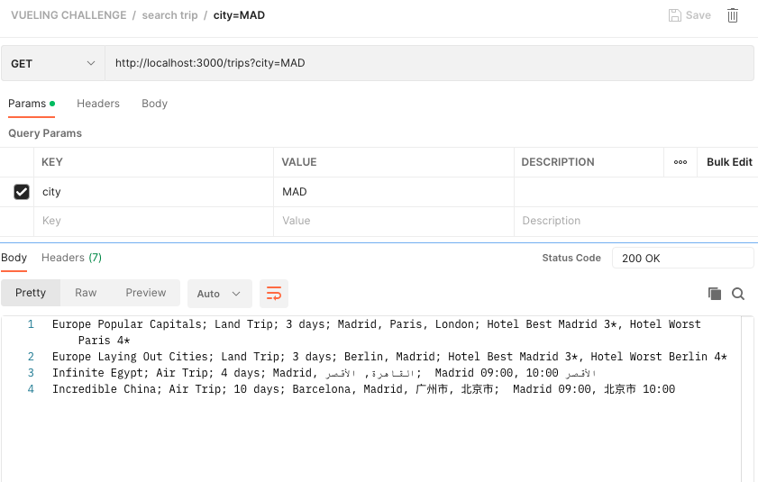

# TRAVEL SEARCH BACKEND

MVP travel search challenge for vueling / nuwe hackaton.

## Getting started.

The project has been developed with:

```
- node.js, 
- express.js, 
- mongoose as ORM, 
- MongoDB as persistence.
````

For the project to work correctly you need to have:

- [Node.js and npm](https://nodejs.org/es/)
- [MongoDB](https://docs.mongodb.com/manual/installation/)
- [Postman](https://www.postman.com/downloads/)

### Project Structure


### Installation 

Clone the project to your local repository.
Change directory to the project folder.

Install the dependencies:

```
npm install
```

### Environment variables .env 

Enable the environment variables converting .env-template into .env and introduce pertinent data.

### Database

Open connection to MongoDB server.

### Commando

Run the app with:

```
npm run start
```
or checkout to dev branch and run in development mode

```
npm run dev
```

### Endpoints

Open collection of endpoints in postman and test away.
Testing result of introducing 'MAD' :



## The challenge:

### Technical Requirements:

Needs to cater for changes of restrictions or new features.

### Functional requirements:

Minimum three letters from standard input requiered to execute the search.
Retrieve results for user input that match anywhere in the cities' names.

A "land trip" has two hotels with names and categories.
An "air trip" has two flights with departure city and departure time.

Supports Middle East and Asian languages.

Output:
- Trip Name.
- Type of trip.
- Duration.
- Names of the cities.
- Specific details (For hotels: name and category, for flights: departure city and time).

Example for «Mad»:

```
Europe Popular Capitals; Land Trip; 3 days; Madrid, Paris, London; Hotel Best Madrid 3*, Hotel Worst Paris 4*
Europe laying out cities; Land Trip; 3 days; Berlín, Madrid; Hotel Best Madrid 3*, Hotel Worst Berlin 4*
Infinite Egipt; Air Trip; 4 days; Madrid, القاهرة, الأقصر; Madrid 09:00, الأقصر 10:00
Incredible China; Air Trip; 10 dies; Barcelona, Madrid, 广州市, 北京市; Madrid 09:00, 北京市 10:00
```
